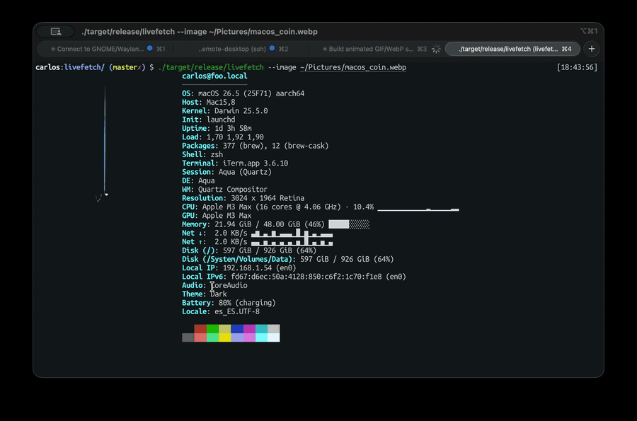

# livefetch

A fastfetch-style system info tool, with two twists the others don't have:

1. **Animated logos** — GIF / WebP / PNG / JPG, rendered with Kitty graphics, iTerm2 inline images, or a half-block ANSI fallback.
2. **Live mode by default** — stays open and refreshes CPU / memory / swap / network every 500 ms, with Unicode sparklines and bars. Use `--once` for the classic snapshot behaviour.



## Install

```sh
cargo install --path .
```

Or build a release binary:

```sh
cargo build --release
# binary lands in target/release/livefetch
```

Requires a recent Rust toolchain (2021 edition).

## Usage

```sh
# Live dashboard (default): refreshes metrics + animates the image until Ctrl-C
livefetch --image ~/Pictures/tux.gif

# Snapshot mode: print info + first frame and exit (good for .zshrc)
livefetch --image ~/Pictures/tux.gif --once

# Custom refresh interval
livefetch --refresh 1000

# Pick the image protocol explicitly
livefetch --protocol kitty   # or iterm2, ansi, none

# Custom module list
livefetch --modules os,kernel,cpu,memory,network

# List every available module
livefetch --list-modules

# Strip a solid background from the logo (handy for transparent-looking gifs)
livefetch --image logo.gif --chroma auto
livefetch --image logo.gif --chroma '#ffffff' --chroma-tolerance 32
```

### Flags

| Flag | Description |
| --- | --- |
| `--image <PATH>` | Image to display (gif / webp / png / jpg). |
| `--protocol <auto\|kitty\|iterm2\|ansi\|none>` | Force a specific image protocol. |
| `--image-cols <N>` | Columns reserved for the image (default 34). |
| `--no-animate` | Render only the first frame. |
| `--once` | Snapshot mode — print and exit. |
| `--refresh <MS>` | Live metrics refresh interval, milliseconds (default 500, min 50). |
| `--modules <a,b,c>` | Override the module list. |
| `--list-modules` | Print every available module + description. |
| `--chroma <auto\|#RRGGBB\|none>` | Remove a solid background colour from the image. |
| `--chroma-tolerance <0-255>` | Per-channel tolerance when matching the chroma colour. |
| `--config <PATH>` | Path to a JSON config (default `~/.config/livefetch/config.json`). |

### Config file

`~/.config/livefetch/config.json` (or `%APPDATA%\livefetch\config.json` on Windows):

```json
{
  "image": "~/Pictures/tux.gif",
  "protocol": "auto",
  "image_cols": 34,
  "animate": true,
  "live": true,
  "refresh_ms": 500,
  "modules": ["title", "separator", "os", "kernel", "cpu", "memory", "network", "colors"],
  "chroma": "auto",
  "chroma_tolerance": 24
}
```

CLI flags always override the config file.

## Modules

Run `livefetch --list-modules` for the full set. A quick summary:

- **Identity**: `title`, `separator`, `os`, `host`, `kernel`, `init`, `uptime`, `loadavg`, `packages`
- **Session**: `shell`, `terminal`, `session`, `de`, `wm`, `resolution`
- **Live metrics**: `cpu`, `cputemp`, `memory`, `swap`, `network`, `disk`
- **Network**: `localip`, `localip6`
- **Misc**: `audio`, `theme`, `battery`, `locale`, `gpu`, `gpudriver`
- **Layout**: `break`, `colors`

Static modules (OS, packages, GPU…) are computed once and cached; only the
live ones (`cpu`, `memory`, `swap`, `network`, …) recompute on each tick.

## Platform support

| Platform | Status |
| --- | --- |
| Linux | First-class. All modules. |
| macOS | First-class. All modules except Linux-specific (`init`, `cputemp`, GTK `theme`). |
| Windows | Core modules work; some platform-specific bits return `n/a`. |

Terminal protocols:

- **Kitty** — Kitty, Ghostty (auto-detected).
- **iTerm2 inline images** — iTerm2, WezTerm.
- **ANSI half-blocks** — fallback for anything else (xterm, Alacritty, tmux, terminals without graphics).

## Why not fastfetch / neofetch?

- They're snapshot-only — print and exit.
- They don't animate logos.

`livefetch` defaults to a small live dashboard (CPU / RAM / network sparklines) next to an animated logo. If you want the snapshot behaviour for `.zshrc`, pass `--once`.

## License

[MIT](LICENSE)
